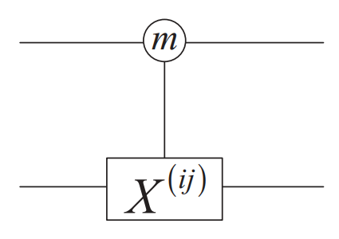
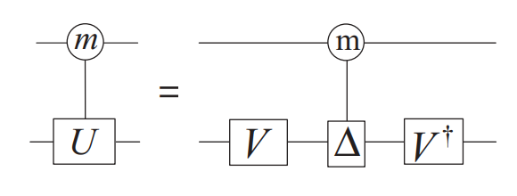
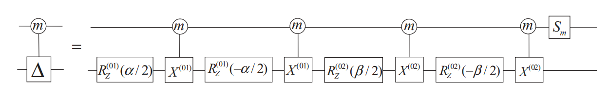
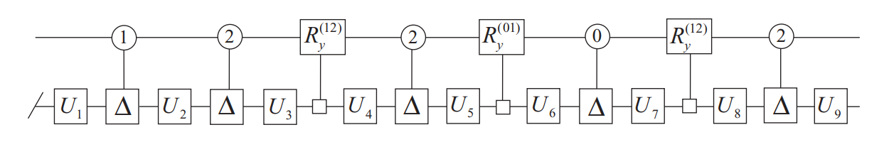
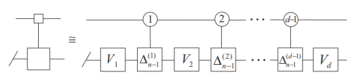
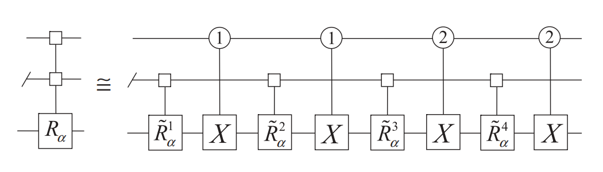

# 高维量子门的最优通用合成

## 内容简介

在量子计算领域，目前大部分的算法和研究都是基于二能级的量子比特 (qubit) 体系。这是由于二能级系统相对较易于实现和操作，具有较长的相干时间和较低的错误率。然而，近年来也有越来越多的研究开始关注高维量子计算。高维量子系统指的是拥有能级更多、态空间维度更高的量子系统，可以通过人工操控多能级的高维量子位 (qudit) 进而实现量子信息的编码、传输、处理与存储。为了能够在量子电路上实现通用计算，需要有一组量子逻辑门可以执行任意的量子态操作，即可以对量子态进行任意的幺正变换，这样的一组量子门构成的集合称为通用量子门集。有许多种方式都能够得到高维体系下的通用量子门集，但其所需要的量子门数量和深度都不是最优的。本次分享将结合两篇文章的研究成果，介绍对于任意高维量子门的最优通用合成方式。

## 相关论文

论文1：Synthesis of multivalued quantum logic circuits by elementary gates

- 作者：Yao-Min Di, Hai-Rui Wei

- 期刊：Physical Review A

论文2：Optimal synthesis of multivalued quantum circuits

- 作者：Yao-Min Di, Hai-Rui Wei

- 期刊：Physical Review A

## 1. 引言

量子计算作为一种基于量子物理的新兴计算范式，具有原理上远超经典计算的强大并行运算能力[1]。它为密码破解、人工智能、气象预报、生物医药、材料科学等所需的大规模计算难题提供了解决方案，并可揭示高温超导、量子相变、量子霍尔效应等复杂物理机制。在量子物理的底层，通常由人工可操控的二能级体系来实现量子比特 (qubit)，例如超导、光子、离子阱和中性原子等物理体系。然而在这些量子体系中天然具有多个量子化的本征态，包括原子中电子能级结构、分子振动能级等，其中蕴含了非常丰富的物理化学性质。虽然上述可操控的量子体系通常含有多个本征态，只是由于高维量子操控技术还不成熟，使得过去的研究更多地关注于量子比特体系下的量子计算和量子模拟。

近年来，高维量子信息科学与技术通过人工操控多能级的高维量子位 (qudit)，进而实现量子信息的编码、传输、处理与存储，有望实现更加强大的量子计算、量子模拟和量子通信等功能。在实验上，高维量子位和高维量子纠缠态已在超导、光子、离子阱和中性原子等体系中实现。在理论上，基于电路模型和测量模型的高维通用量子计算已被证明为可行的[2,3]，且有助于提升量子计算算法的性能、降低量子纠错所需物理资源等。高维量子系统的优势使其成为量子计算和量子信息处理领域重要的研究方向，具备广阔的应用前景，如量子模拟、量子纠错、量子优化和量子机器学习等领域。 

在经典计算中，使用布尔代数中的三种基本运算：与 $\rm AND$、或 $\rm OR$、非 $\rm NOT$，便可以完成任意的逻辑操作，称这样的运算在经典计算中是普适的或通用的 (universal)。在量子计算中，由于所有的操作都是幺正变换，这样的幺正操作也可以通过一组量子逻辑门集合的组合来实现或以任意精度近似，这样的量子门集合被称为通用门集[1]。

在量子比特体系下，使用单比特旋转门 $Rx,Ry,Rz$ 和两比特受控门 $\text{CNOT}$ 便可以实现通用量子计算。而使用 $H,T$ 门可以任意精度近似一个旋转门，这样的 $\{H,T,\text{CNOT}\}$ 被称为离散通用门集。在通常的量子计算中，并不要求所有基础门都是离散的，适当使用含参的旋转门能够有效降低电路中门的数量和深度。

本文介绍了一种对于任意 $d$ 维量子门的最优通用合成方法，使用旋转门、相位门和受控 X 门 $\{Ry,Rz,S_m,\text{GCX}\}$ 作为通用门集。

## 2. 高维量子门

正如二进制位是经典计算中信息的基础对象一样，量子比特 (quantum bit, qubit) 是量子计算中信息的基础对象。而高维量子位 (quantum digit, qudit) 便是基于 $d$ 进制数的高维量子计算中的信息基础对象，其状态可以通过 $d$ 维希尔伯特 (Hilbert) 空间 $\mathcal{H}_d$ 中的向量来描述，该空间可以由一组 $d$ 维的标准正交基 $\{\ket{0},\ket{1},\dots,\ket{d-1}\}$ 构成[4]。高维量子态用于描述高维量子系统的状态，通常会写成如下形式：
$$
\ket{\alpha}=\alpha_0\ket{0}+\alpha_1\ket{1}+\cdots+\alpha_{d-1}\ket{d-1}\in\mathbb{C}^d
=\begin{pmatrix}\alpha_0\\\alpha_1\\\vdots\\\alpha_{d-1}\end{pmatrix},\quad
\sum_{j=0}^{d-1}|\alpha_j|^2=1
$$

高维量子位可以替代量子比特作为量子计算的基本元素，而高维量子逻辑门可以用于操作和变换高维量子态。在量子比特体系中，基础的量子逻辑门有泡利门 $X,Y,Z$、旋转门 $Rx,Ry,Rz$ 以及受控门 $\text{CNOT}$，它们的矩阵形式分别如下：
$$
X=\begin{pmatrix}
0 & 1 \\ 1 & 0
\end{pmatrix},\quad
Y=\begin{pmatrix}
0 & -i \\ i & 0
\end{pmatrix},\quad
Z=\begin{pmatrix}
1 & 0 \\ 0 & -1
\end{pmatrix},\quad
\text{CNOT}
\begin{pmatrix}
1 & 0 & 0 & 0 \\
0 & 1 & 0 & 0 \\
0 & 0 & 0 & 1 \\
0 & 0 & 1 & 0
\end{pmatrix}
$$

$$
Rx(\theta)
=\begin{pmatrix}
\cos\frac{\theta}{2} & -i\sin\frac{\theta}{2} \\
-i\sin\frac{\theta}{2} & \cos\frac{\theta}{2}
\end{pmatrix},\quad
Ry(\theta)
=\begin{pmatrix}
\cos\frac{\theta}{2} & -\sin\frac{\theta}{2} \\
\sin\frac{\theta}{2} & \cos\frac{\theta}{2}
\end{pmatrix},\quad
Rz(\theta)
=\begin{pmatrix}
e^{-i\theta/2} & 0 \\
0 & e^{i\theta/2}
\end{pmatrix}
$$
在高维量子位体系中，基础的高维量子门是量子比特门的推广，是将上述的量子比特门映射到 $d$ 维希尔伯特空间的二维子空间 $\mathcal{H}_{ij}$ 中[5]。任意 $d$ 维的量子泡利门和旋转门可以由 $SU(d)$ 群的生成元 $\sigma_\alpha^{(i,j)}$ 得到，其中 $\alpha\in\{x,y,z\},\;0\le i<j\le d-1$ 
$$
\begin{aligned}
\sigma_x^{(i,j)}&=\ket{i}\bra{j}+\ket{j}\bra{i},
&X_d^{(i,j)}=\sigma_x^{(i,j)}+\sum_{k\ne i,j}\ket{k}\bra{k},\qquad
&Rx_d^{(i,j)}=\exp\{-\mathrm{i}\theta \sigma_x^{(i,j)}/2\} \\
\sigma_y^{(i,j)}&=-\mathrm{i}\ket{i}\bra{j}+\mathrm{i}\ket{j}\bra{i},
&Y_d^{(i,j)}=\sigma_y^{(i,j)}+\sum_{k\ne i,j}\ket{k}\bra{k},\qquad
&Ry_d^{(i,j)}=\exp\{-\mathrm{i}\theta \sigma_y^{(i,j)}/2\} \\
\sigma_z^{(i,j)}&=\ket{i}\bra{i}-\ket{j}\bra{j},
&Z_d^{(i,j)}=\sigma_z^{(i,j)}+\sum_{k\ne i,j}\ket{k}\bra{k},\qquad
&Rz_d^{(i,j)}=\exp\{-\mathrm{i}\theta \sigma_z^{(i,j)}/2\}
\end{aligned}
$$

举例说明，在 $d=3$ 的 qutirt 体系下，泡利门和旋转门的矩阵形式分别如下：
$$
X_3^{(0,1)}=\begin{pmatrix}
0 & 1 & 0 \\ 1 & 0 & 0 \\ 0 & 0 & 1
\end{pmatrix},\quad
Y_3^{(0,2)}=\begin{pmatrix}
0 & 0 & -\mathrm{i} \\ 0 & 1 & 0 \\ \mathrm{i} & 0 & 0
\end{pmatrix},\quad
Z_3^{(1,2)}=\begin{pmatrix}
1 & 0 & 0 \\ 0 & 1 & 0 \\ 0 & 0 & -1
\end{pmatrix}
$$

$$
Rx_3^{(0,1)}(\theta)=\begin{pmatrix}
\cos\frac{\theta}{2} & -\mathrm{i}\sin\frac{\theta}{2} & 0 \\
-\mathrm{i}\sin\frac{\theta}{2} & \cos\frac{\theta}{2} & 0 \\
0 & 0 & 1
\end{pmatrix},\;\;
Ry_3^{(0,2)}(\theta)=\begin{pmatrix}
\cos\frac{\theta}{2} & 0 & -\sin\frac{\theta}{2} \\ 0 & 1 & 0 \\ \sin\frac{\theta}{2} & 0 & \cos\frac{\theta}{2}
\end{pmatrix},\;\;
Rz_3^{(1,2)}(\theta)=\begin{pmatrix}
1 & 0 & 0 \\ 0 & \mathrm{e}^{-i\theta/2} & 0 \\ 0 & 0 & \mathrm{e}^{i\theta/2}
\end{pmatrix}
$$

对于受控量子门，与量子比特受控门 $\text{CNOT}$ 只能控制 $\ket{1}$ 态不同，高维受控门可以控制某个特定的量子态[5]。受控 X 门 (general controlled X, $\text{GCX}$) 为 $\text{CNOT}$ 门在高维量子计算中的推广。当控制位为 $\ket{m}$ 态时，作用泡利 $X_d^{(i,j)}$ 门到目标位上，其中受控态需满足 $0\le m\le d-1$。受控 X 门的电路形式如图1所示。对于任何高维单量子门，例如高维泡利门和旋转门，都能够生成类似的双量子位受控门。
$$
\text{GCX}\Big(m\to X_d^{(i,j)}\Big)\ket{x,y}
=\left\{\begin{array}{c}
\ket{x}\otimes  X_d^{(i,j)}\ket{y} & x=m \\
\ket{x,y} & x\ne m
\end{array}\right.
$$

$$
\text{GCX}\Big(m\to X_d^{(i,j)}\Big)
=\ket{m}\bra{m}\otimes X_d^{(i,j)}+\sum_{n\ne m}\ket{n}\bra{n}\otimes I_{d}
=\begin{pmatrix}
I_{dm} & \\ & X_d^{(i,j)} \\ && I_{d(d-m-1)}
\end{pmatrix}
$$

利用奇异值分解 (singular value decomposition, SVD) 的原理，受控幺正矩阵门如图2分解为两个单量子位幺正门和一个受控对角门。由于 $d\times d$ 对角矩阵可以如下分解，则每个受控对角门都由一个相位门和 $d-1$ 个受控旋转门 $Rz^{(i,j)}(\theta)$ 合成，而每个受控旋转门能够分解为两个旋转门和一个受控 X 门。
$$
U=V\Delta V^\dagger,\quad
\Delta=\mathrm{e}^{\mathrm{i}\varphi}Rz^{(0,1)}(\theta_1)\,Rz^{(0,2)}(\theta_2)\cdots Rz^{(0,d-1)}(\theta_{d-1})
$$

以 $d=3$ 的 qutirt 体系为例，受控对角门可以分解成图3形式，其中 $S_m$ 为作用与 $\ket{m}$ 态的相位门：

$$
S_m=\mathrm{e}^{\mathrm{i}\varphi}\ket{m}\bra{m}+\sum_{i\ne m}\ket{i}\bra{i}
$$

## 3. 最优通用合成

对于一个单量子门 $U\in U(d)$，可以使用 Cartan 分解将其拆分成 $\binom{d}{2}=d(d-1)/2$ 个作用在二维希尔伯特子空间的 $d$ 维幺正矩阵[6]
$$
U=\mathrm{e}^{\mathrm{i}\varphi}U^{(0,1)}\,U^{(0,2)}\cdots U^{(0,d-1)}\,U^{(1,2)}\cdots U^{(d-2,d-1)}
$$
与量子比特体系类似，使用 ZYZ 或 XYX 分解将 $U^{(i,j)}$ 进一步分解成旋转门 $Rx^{(i,j)},Ry^{(i,j)},Rz^{(i,j)}$ 
$$
U^{(i,j)}=Rz^{(i,j)}(\phi)\,Ry^{(i,j)}(\theta)\,Rz^{(i,j)}(\lambda)
=Rx^{(i,j)}(\phi')\,Ry^{(i,j)}(\theta')\,Rx^{(i,j)}(\lambda')
$$

对于多位量子门来说，需要先将该量子门分解成单量子门和双量子门的组合，再对逐步使用通用量子门集来合成相应的单/双量子门。

### 3.1. 余弦正弦分解

使用余弦正弦分解 (cosine-sine decomposition, CSD) 能够得到将多位量子门 $W\in U(d^n)$ 分解成 $d^{n-1}\times d^{n-1}$ 分块对角矩阵和余弦正弦矩阵[7]。设 $W=U\Gamma V$ 为余弦正弦分解的第一步分解形式
$$
U=\,\begin{array}{r}
r \\ d^n-r
\end{array}
\begin{pmatrix}
U_1 \\ & U_2
\end{pmatrix},\quad
\Gamma=\begin{array}{r}
r \\ r \\ d^n-2r
\end{array}
\begin{pmatrix}
C & -S \\
S & C \\
&& I_{d^n-2r}
\end{pmatrix},\quad
V=\,\begin{array}{r}
r \\ d^n-r
\end{array}
\begin{pmatrix}
V_1 \\ & V_2
\end{pmatrix}
$$

其中分块阶数为 $r=\lfloor d/2\rfloor d^{n−1}$，$U_1,V_1$ 为 $r\times r$ 幺正矩阵，$U_2,V_2$ 为 $(d^n-r)\times(d^n-r)$ 幺正矩阵，$C,S$ 为 $r\times r$ 对角余弦正弦矩阵
$$
C=\begin{pmatrix}
\cos\theta_1 \\
& \cos\theta_2 \\
&& \ddots \\
&&& \cos\theta_r
\end{pmatrix},\quad
S=\begin{pmatrix}
\sin\theta_1 \\
& \sin\theta_2 \\
&& \ddots \\
&&& \sin\theta_r
\end{pmatrix}
$$
此处对于任意 $\theta_i\,(0\le i\le r)$ 均有 $\sin^2\theta_i+\cos^2\theta_i=1$。对于 $U_1,U_2,V_1,V_2$ 继续执行余弦正弦分解直到分解为 $d^{n-1}\times d^{n-1}$ 分块对角矩阵。

### 3.2. 量子香农分解

使用量子香农分解 (quantum Shannon decomposition, QSD) 能够递归地分解多位量子门，是用于合成通用量子比特电路的最优方式[8]。同理可以将其推广到高维量子电路中，以 $d=3$ 的 qutirt 体系为例展示 QSD 的合成过程[9]。设 $W$ 为 $3^n\times 3^n$ 阶幺正矩阵，对其采取余弦正弦分解得到
$$
W=U\Gamma V=
\begin{pmatrix}
U_1 \\ & U_2
\end{pmatrix}
\begin{pmatrix}
C & -S \\
S & C \\
&& I
\end{pmatrix}
\begin{pmatrix}
V_1 \\ & V_2
\end{pmatrix}
$$

对于 $2\times3^{n-1}$ 阶幺正矩阵 $U_2,V_2$ 继续执行余弦正弦分解得到
$$
U_2=\begin{pmatrix}
U_{2,1} \\ & U_{2,2}
\end{pmatrix}
\begin{pmatrix}
C_1 & -S_1 \\ S_1 & C_1
\end{pmatrix}
\begin{pmatrix}
U_{2,3} \\ & U_{2,4}
\end{pmatrix},\quad
V_2=\begin{pmatrix}
V_{2,1} \\ & V_{2,2}
\end{pmatrix}
\begin{pmatrix}
C_2 & -S_2 \\ S_2 & C_2
\end{pmatrix}
\begin{pmatrix}
V_{2,3} \\ & V_{2,4}
\end{pmatrix}
$$

$$
U=A\Gamma_1B=
\begin{pmatrix}
U_1 \\ & U_{2,1} \\ && U_{2,2}
\end{pmatrix}
\begin{pmatrix}
I \\ & C_1 & -S_1 \\ & S_1 & C_1
\end{pmatrix}
\begin{pmatrix}
I \\ & U_{2,3} \\ && U_{2,4}
\end{pmatrix}
$$

$$
V=C\Gamma_2D=
\begin{pmatrix}
V_1 \\ & V_{2,1} \\ && V_{2,2}
\end{pmatrix}
\begin{pmatrix}
I \\ & C_2 & -S_2 \\ & S_2 & C_2
\end{pmatrix}
\begin{pmatrix}
I \\ & V_{2,3} \\ && V_{2,4}
\end{pmatrix}
$$

至此每个分块矩阵均为 $3^{n-1}\times 3^{n-1}$ 幺正矩阵，并将部分矩阵分解成张量积形式
$$
A'=(I\otimes U_{2,1})
\begin{pmatrix}
I \\ & I \\ && U_{2,2}'
\end{pmatrix},\quad
B'=(I\otimes U_{2,3})
\begin{pmatrix}
U_2' \\ & I \\ && I
\end{pmatrix}, \\
C'=(I\otimes V_{2,1})
\begin{pmatrix}
I \\ & I \\ && V_{2,2}'
\end{pmatrix},\quad
D'=\begin{pmatrix}
V_2' \\ & V_{2,3} \\ && V_{2,4}
\end{pmatrix}
$$

$$
U_{2,2}'=U_{2,1}^{-1},\quad U_2'=U_{2,3}^{-1}U_{2,1}^{-1}U_1,\quad
V_{2,2}'=V_{2,1}^{-1}U_{2,3}^{-1}U_{2,4}V_{2,2},\quad V_2'=V_{2,1}^{-1}U_2'
$$

由此得到分解形式 $W=A'\,\Gamma_1\,B'\,\Gamma\,C'\,\Gamma_2\,D'$。可以将 $A',C'$ 分别对应于一个控制 $\ket{2}$ 态的受控幺正门，$B'$ 对应于一个控制 $\ket{0}$ 态的受控幺正门，$D'$ 对应于两个分别控制 $\ket{1},\ket{2}$ 态的受控幺正门。将这些受控幺正矩阵门继续分解，能够得到 9 个幺正矩阵门和 5 个受控对角门。而余弦正弦矩阵 $\Gamma$ 则可以分解成一组均匀受控 $Ry^{(0,1)}$ 门，用方块 $\square$ 表示控制位，同理 $\Gamma_1,\Gamma_2$ 同样能够一组均匀受控 $Ry^{(1,2)}$ 门合成。基于 QSD 的 3 维量子电路通用合成结构如图4所示，斜杠 $/$ 代表该行上的多个量子位。

此处的均匀受控门是指一组控制 $\ket{1},\ket{2},\dots,\ket{d-1}$ 态的受控门，其奇异值分解形式如图5。均匀受控 $Ry$ 门的分解仅需要 $d-1$ 个控制不同态的受控 $Ry$ 门，而多个量子位的均匀受控 $Ry$ 门能够如图6分解。

通过将 $n$ 量子位 $d$ 维幺正矩阵门分解成一系列 $n-1$ 位幺正矩阵门、受控对角门和均匀受控 $Ry$ 门，利用 QSD 的递归思路持续分解 $n-1$ 位幺正矩阵门，最终形成能够合成任意的 $n$ 位量子门的电路结构，实现高维量子门的最优通用合成。

## 4. 总结

本次介绍的两篇文章通过改进的余弦正弦分解和量子香农分解，优化了高维量子门合成结构，且该合成方式对于任意维数 $d$ 都是渐近最优的。运用了递归的思路，适用于多量子位的高维量子电路。为后续的理论和实验研究提供了一组高效的通用量子门集合。

## 参考文献

[1] Nielsen M A, Chuang I L. Quantum Computation and Quantum Information[M]. Cambridge University Press, 2010.

[2] Luo M, Wang X. Universal quantum computation with qudits[J]. Science China Physics, Mechanics & Astronomy, 2014, 57(9): 1712-1717.

[3] Wang Y, Hu Z, Sanders B C, et al. Qudits and High-Dimensional Quantum Computing[J]. Frontiers in Physics, 2020, 8: 589504.

[4] Brylinski J L, Brylinski R. Universal quantum gates[J]. Mathematics of quantum computation, 2002, 79.

[5] Di Y M, Wei H R. Synthesis of multivalued quantum logic circuits by elementary gates[J]. Physical Review A, 2013, 87(1): 012325.

[6] Helgason S. Differential geometry, Lie Groups, and Symmetric Spaces[M]. Academic Press, 1979.

[7] Khan F S, Perkowski M. Synthesis of multi-qudit hybrid and d-valued quantum logic circuits by decomposition[J]. Theoretical Computer Science, 2006, 367(3): 336-346.

[8] Shende V V, Bullock S S, Markov I L. Synthesis of Quantum-Logic Circuits[J]. IEEE Transactions on Computer-Aided Design of Integrated Circuits and Systems, 2006, 25(6): 1000-1010.

[9] Di Y M, Wei H R. Optimal synthesis of multivalued quantum circuits[J]. Physical Review A, 2015, 92(6): 062317.